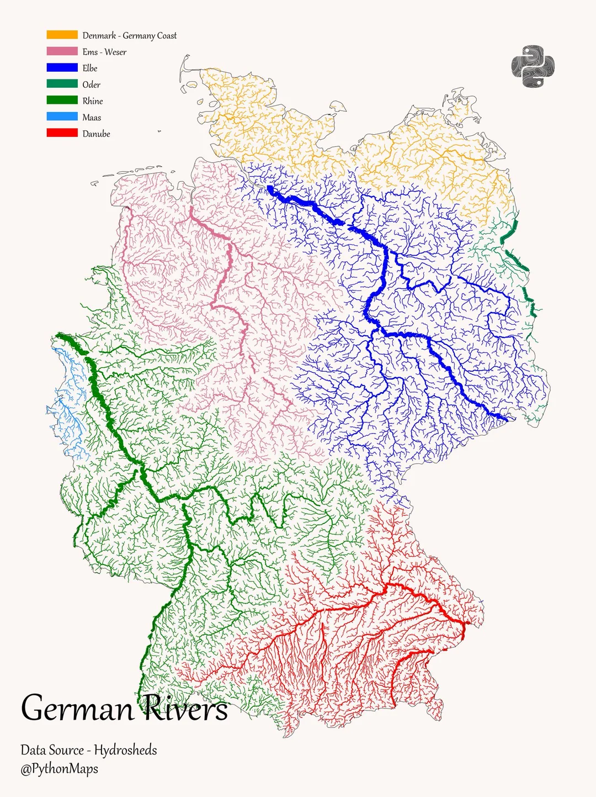
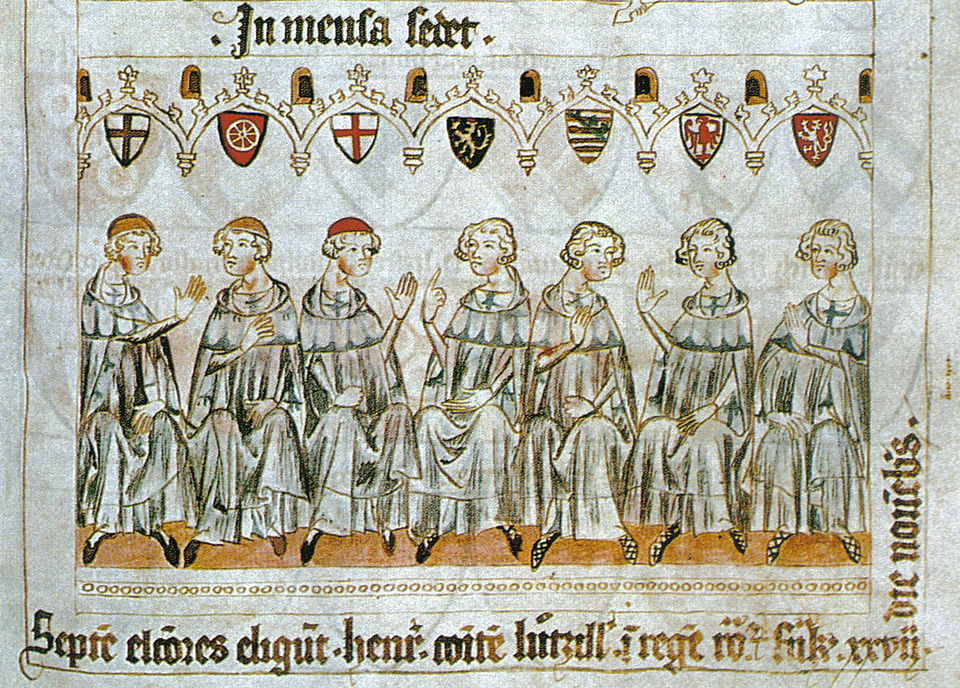
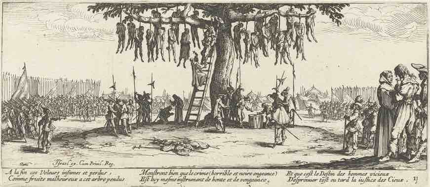

# The Shortest History of Germany

- The book quotes [The History of the Decline and Fall of the Roman Empire](https://en.wikipedia.org/wiki/The_History_of_the_Decline_and_Fall_of_the_Roman_Empire) very often, by simply saying `(Gibbon)`.

## Proto (500 BC - 58 BC)

- Tsar Vladimir, Vladimir the Great: 958-1015
- [Joschka Fischer, The End of the West, 5 Dec 2016](https://www.weforum.org/stories/2016/12/is-this-the-end-of-the-west-asks-joschka-fischer/)
- First record via *quis vs was* is around `500 BC`, north of Rhine and Elbe, well over Danube. Most south being around Lower Saxony and then to current Denmark and South Sweden, around Stockholm.
	- `Danube`: From Black Forest to Black Sea. Second longest river in Europe
	- `Rhine`: From Swiss Alps to North Sea
	- `Elbe`: From Giant Mountains (Czech) to North Sea, east of Rhine. This is the one that Spree flows into 
- Around 150 BC proto-Germans had started interacting with the Mediterranean world, civilisation.
- They were considered just generic barbarians. *No one ever called anyone a German until 58 BC*. 

## Takeover (58 BC - 526 AD)

- Marcus Tullius Cicero: 03.01.106 - 07.12.43 BC
- Julius Caesar: 12.07.100 - 15.03.44 BC
- Caesar names them: *Germani*. [First description](https://la.wikisource.org/wiki/Commentarii_de_bello_Gallico/Liber_VI#22) of them are given in `Commentarii de Bello Gallico`, book 6, 21-28.
- An inspiring passage from the [translation](https://www.perseus.tufts.edu/hopper/text?doc=Perseus%3Atext%3A1999.02.0001%3Abook%3D6%3Achapter%3D21):
	> "*Those who have remained chaste for the longest time, receive the greatest commendation among their people; they think that by this the growth is promoted, by this the physical powers are increased and the sinews are strengthened. And to have had knowledge of a woman before the twentieth year they reckon among the most disgraceful acts...*"
- Caesar was governer of Cisalpine Gaul, a Roman province, now most of nothern Italy
- [Battle of Vosges](https://en.wikipedia.org/wiki/Battle_of_Vosges_(58_BC))
- On receipt of reports that Caesar had attacked during a truce but won a victory in which he killed some 430 thousand Germans, Cato the Younger objected to it as a sacrilege and demanded Caesar's surrender to the Germans. None joined him.
- `Battle of the Teutoburg Forest`: September 8–11, 9 AD, considered one of the most important defeats in Roman history, bringing the triumphant period of expansion under Augustus to an abrupt end. It dissuaded the Romans from pursuing the conquest of Germania, and so can be considered *one of the most important events in European history*.
- *"The Rhineland was secure again. The Roman army, like all armies, preferred tough boys from the backwoods to city youths, and the Germans now became their most-favoured recruits."*
- All the greatest cities of future Austria and West German except Hamburg grew up within the Roman Empire.
-  Jacobite rising of 1745, Highland Scots tried to invade England. As soon as they are beaten, the British Army began using them as shock-troops, and the English public romanticized invaders. So it was with the Romans and Germans in 100 AD, see [Germania](https://en.wikipedia.org/wiki/Germania_(book)).
-  The Goths are the first barbarians ever to kill a Roman Emperor, in 251 AD. By the fourth century, they'd become the first Christian, literate Germans, and had even translated the Bible from Greek into Gothic.
-  In 378 AD Goths killed Emperor Valens at the [Battle of Adrianople](https://en.wikipedia.org/wiki/Battle_of_Adrianople) (Edirne). The battle is often considered the start of the events which led to the fall of the Western Roman Empire in the 5th century. 
-  Some Latin: *de facto* vs *de jure*. Here `de` means of/by/about/concerning. Like in *Commentarii de Bello Gallico*.
-  Theodoric the Great (454-526 AD), see [Mausoleum of Theodoric](https://en.wikipedia.org/wiki/Mausoleum_of_Theodoric#/media/File:Mausoleum_of_Theodoric_(Ravenna)_-_Exterior.jpg). He provided thirty years of stable rule in Italy, a first since Constantine two centuries earlier.

## Restoration (526 AD - 983 AD)

- Merovingians ran their Franco-German empire through Latin codices which mixed tribal Germanic laws with the Roman legal heritage, around 700 AD. See [Leges Visigothorum](https://www.documentacatholicaomnia.eu/03d/0506-0506,_AA_VV,_Leges_Romanae_Visigotorum_[Scott_JP_Curatore],_EN.pdf). They were able to stand their ground and filled the power vacuum after the dislocations, such as Gothic Wars.
- Foederati were peoples and cities bound by a treaty, known as foedus, with Rome.
- [Battle of Tours](https://en.wikipedia.org/wiki/Battle_of_Tours) was fought on 10.10.732, was an important battle during the Umayyad invasion of Gaul.
- In 753 AD, Stephen II became the first Pope ever to journey north of the Alps. See [donation of Pepin](https://en.wikipedia.org/wiki/Donation_of_Pepin).
- Charlemagne (748-	814), king of Franks, Lombards and Emperor of the Carolingian Empire was the first recognised emperor to rule from the west after the fall of the Western Roman Empire approximately three centuries earlier. Charlemagne's reign was marked by political and social changes that had lasting influence on Europe throughout the Middle Ages.
- The Hildebrandslied is the earliest poetic text in Althochdeutsch. See [Rostam and Sohrab](https://en.wikipedia.org/wiki/Rostam_and_Sohrab) in Şahname.
- Origin of `deutsch`: [`theodisce`](https://en.wikipedia.org/wiki/Theodiscus), around 800 AD. It means non-Latinate Frankish tongues, comes from Anglo-Saxons.
- Old French is a blend of Romance base from Vulgar Latin spoken in Gaul and Germanic flavor from the Franks. See [Oaths of Strasbourg](https://en.wikipedia.org/wiki/Oaths_of_Strasbourg).
- [Eldgjá eruption](https://en.wikipedia.org/wiki/Eldgj%C3%A1#10th_century_eruption) happened which forced Germans to go back to to electing kings. 
- First rulers of East Francia: [Louis the Child](https://en.wikipedia.org/wiki/Louis_the_Child), then first non-Carolingian and elected king [Conrad I of Germany](https://en.wikipedia.org/wiki/Conrad_I_of_Germany). Then comes Henry the Fowler, and his son  Otto The Great (960).
- Word for Germans in Slavic languages originates from `nemoy`, non-speakers.
- Otto I used [Translatio imperii](https://en.wikipedia.org/wiki/Translatio_imperii) to be Emperor of the Holy Roman Empire.
- [Slavic revolt of 983](https://en.wikipedia.org/wiki/Slavic_revolt_of_983) is as central to Slavic history as 9 AD is to German history.

## Battle for Germany (983 - 1525)
- Kings, nobility and the Church: Natural leaders of Europe, Roman Emperors, elections
- [Investiture controversy](https://en.wikipedia.org/wiki/Investiture_Controversy#German_culture) caused Germany to lose its intellectual leadership and never regain it throughout the rest of the Middle Ages. It escalated with [Road to Canossa](https://en.wikipedia.org/wiki/Road_to_Canossa), 1077, by the Holy Roman Emperor Henry IV (also see [Canossagang, Gang nach Canossa](https://www.duden.de/rechtschreibung/Canossagang)). It ended with [Concordat of Worms](https://en.wikipedia.org/wiki/Concordat_of_Worms), 1122, in the benefit of the nobles and churchmen.
- [Medieval Warm Period](https://en.wikipedia.org/wiki/Medieval_Warm_Period) enabled proper entry to east of Elbe, [Wendish Crusade](https://en.wikipedia.org/wiki/Wendish_Crusade), 1147.
- der Kurfürst (-en), prince-electors. Fürst means prince.

- Current Lower Saxony, Niedersachsen is in the north-west. It is the land of Old Saxony. Then there is Saxony with Dresden as its capital, which is also called Obersachsen. There is also Saxony-Anhalt in between.
- 13th century, somewhat a golden age was also fruitful for literature: [Nibelungenlied](https://en.wikipedia.org/wiki/Nibelungenlied), [Tristan and Iseult](https://en.wikipedia.org/wiki/Tristan_and_Iseult), [Parzival](https://en.wikipedia.org/wiki/Parzival).
- [The Golden Bull of Rimini](https://en.wikipedia.org/wiki/Golden_Bull_of_Rimini) was a decree issued by Emperor Frederick II in Rimini in March 1226 that granted and confirmed the privilege of territorial conquest and acquisition for the Teutonic Order in Prussia.
- [Martin Luther](https://en.wikipedia.org/wiki/Martin_Luther) (1483–1546): German monk, theologian. 1517: 95 Theses, opposed indulgences. Sparked Protestant Reformation. Key ideas: [sola fide](https://en.wikipedia.org/wiki/Sola_fide) (faith alone), sola scriptura (scripture alone). Translated Bible into German. Excommunicated by Pope. Defied Diet of Worms. See [Ninety-five Theses](https://en.wikipedia.org/wiki/Ninety-five_Theses).
- Starting with the election of [Emperor Charles V](https://en.wikipedia.org/wiki/Charles_V,_Holy_Roman_Emperor) in 1519, an [electoral capitulation](https://en.wikipedia.org/wiki/Electoral_capitulation) was presented by the prince-electors to the future emperor.
- In 1525, [Grand Master Albert](https://en.wikipedia.org/wiki/Albert,_Duke_of_Prussia) secularized the Teutonic Order, embraced [Lutheranism](https://en.wikipedia.org/wiki/Lutheranism), and established the Duchy of Prussia, the first Protestant state in Europe.

## Two Ways (1525 - present)
- The [Schmalkaldic League](https://en.wikipedia.org/wiki/Schmalkaldic_League) was a military alliance of Lutheran principalities and cities within the Holy Roman Empire during the mid-16th century.
- The [Peace of Augsburg](https://en.wikipedia.org/wiki/Peace_of_Augsburg) was a treaty between Charles V, Holy Roman Emperor, and the Schmalkaldic League, 1555.
- [Cuius regio, eius religio](https://en.wikipedia.org/wiki/Cuius_regio,_eius_religio)
- [Thirty Years’ War](https://en.wikipedia.org/wiki/Thirty_Years%27_War) (1618–1648): Central European war, mostly in Holy Roman Empire. Trigger: [Defenestration of Prague](https://en.wikipedia.org/wiki/Defenestration_of_Prague). Religious (Catholic vs Protestant), became political. Major powers: Spain, France, Sweden, Habsburgs. Ended with [Peace of Westphalia](https://en.wikipedia.org/wiki/Peace_of_Westphalia). 8 million+ dead, devastated Germany, shifted European power balance.

- [Battle of Zenta](https://en.wikipedia.org/wiki/Battle_of_Zenta) (1697): Major clash in [Great Turkish War](https://en.wikipedia.org/wiki/Great_Turkish_War), part of [Holy League](https://en.wikipedia.org/wiki/Holy_League_(1684)) effort vs Ottomans. Habsburgs under [Prince Eugene of Savoy](https://en.wikipedia.org/wiki/Prince_Eugene_of_Savoy) surprised Ottomans at Tisa River. Ottoman army crushed, 20,000+ casualties. Led to [Treaty of Karlowitz](https://en.wikipedia.org/wiki/Treaty_of_Karlowitz) (1699), Ottoman loss of Hungary, Croatia, Transylvania.
- [Romanticism](https://en.wikipedia.org/wiki/Romanticism) (late 18th–mid 19th c.): Artistic and intellectual movement reacting against Enlightenment rationalism and industrialization; emphasized emotion, nature, imagination, and the medieval past. German thinkers like Goethe played a foundational role.
- [Seven Years' War](https://en.wikipedia.org/wiki/Seven_Years%27_War) (1756–1763): Global conflict centered in Europe; Prussia, led by Frederick the Great, survived against a coalition of Austria, France, Russia, and others, securing its status as a major European power.
- [Battle of Leipzig](https://en.wikipedia.org/wiki/Battle_of_Leipzig) (1813) and [Battle of Waterloo](https://en.wikipedia.org/wiki/Battle_of_Waterloo) (1815): Coalition forces defeated Napoleon in Leipzig (largest pre-WWI battle), forcing retreat; final defeat at Waterloo ended Napoleonic Wars and led to his exile to Saint Helena.
- [Carlsbad Decrees](https://en.wikipedia.org/wiki/Carlsbad_Decrees) (1819): Laws passed by the [German Confederation](https://en.wikipedia.org/wiki/German_Confederation). Banned student groups, censored newspapers, and put universities under state control to stop [liberal](https://en.wikipedia.org/wiki/Liberalism) and [nationalist](https://en.wikipedia.org/wiki/Nationalism) ideas.
- [Weltgeist](https://en.wikipedia.org/wiki/Absolute_idealism): Central concept in Hegel’s philosophy. The rational force unfolding through history, guiding humanity toward freedom and self-awareness. Not a deity, but the totality of human reason, realized through events, cultures, and great individuals. See [Hegel](https://en.wikipedia.org/wiki/Georg_Wilhelm_Friedrich_Hegel).
- The first demand in [Märzforderungen](https://de.wikipedia.org/wiki/Märzforderungen) during [The German revolutions of 1848–1849](https://en.wikipedia.org/wiki/German_revolutions_of_1848–1849) has a similarity to the Second Amendment. Russian despotism was helpful to make revolution fail and German autocracies win.

- [Otto von Bismarck](https://en.wikipedia.org/wiki/Otto_von_Bismarck) (1815–1898): Prussian statesman, diplomat. 1862: Appointed Minister-President of Prussia by King William I. Architect of German unification. Led wars against Denmark (1864), Austria (1866), France (1870–71). 1871: Proclaimed German Empire, became first Chancellor. Practiced Realpolitik. Introduced social insurance laws. Dismissed by Kaiser Wilhelm II in 1890. See [German unification](https://en.wikipedia.org/wiki/Unification_of_Germany).
- [Dreiklassenwahlrecht](https://en.wikipedia.org/wiki/Prussian_three-class_franchise) (1849–1918): Prussian three-class franchise system. Voters divided by tax contribution. Class 1 (wealthiest ~5%) elected 1/3 of electors; Class 2 (~15%) another 1/3; Class 3 (majority ~80%) the final 1/3. Supported by Bismarck to maintain conservative control in the Landtag. Abolished after German Revolution of 1918.