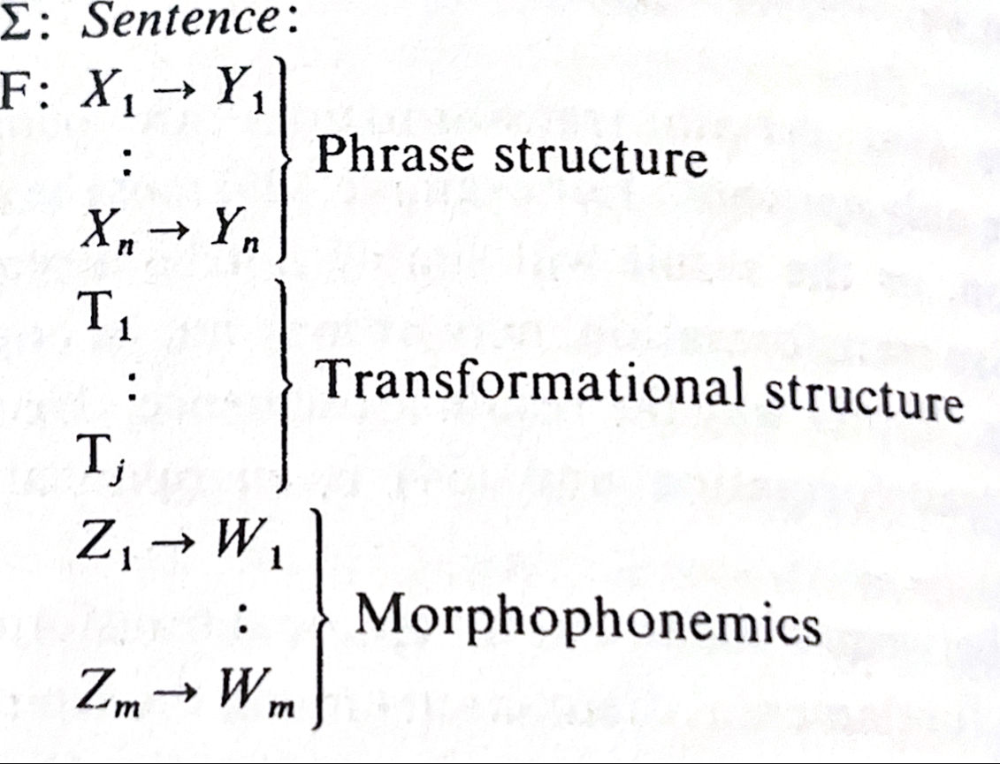

# [Syntactic Structures](https://en.wikipedia.org/wiki/Syntactic_Structures)
A short monograph by [Noam Chomsky](https://en.wikipedia.org/wiki/Noam_Chomsky), published in 1957.

Chomsky was a student of [Zellig Sabbettai Harris](https://en.wikipedia.org/wiki/Zellig_Harris), who is a very interesting man.

## Notes
- p. vi: What is mentioned is the "childhood exposure to initial linguistic experience". How about vision?
- p. x: "If the sentences don't occur, they can't be part of the primary data". Why can't consistent absence lead to learning?
- p. 5: "By pushing a precise but inadequate formulation to an unacceptable conclusion, we can often expose the exact source of this inadequacy and, consequently, gain a deeper understanding...".
- p. 13: "... suppose that we assume intuitive knowledge of the grammatical sentences of English...".
- **(1)** p. 17: "... grammar is autonomous and independent of meaning, and that probabilistic models give no particular insight into some of the basic problems of syntactic structure.". Observe that this somehow doesn't contradict with (2).
- p. 20: "Each state through which he passes represents the grammatical restrictions that limit the choice of the next word at this point in the utterance.". In this context one can easily see "next word", initial and final "tokens".
- p. 29: One crucial aspect of the phrase structure level is that "... only a single of X can be rewritten in forming Y".
- p. 34: "... I do not know whether or not English is itself literally outside the range of such [phrase structure] analysis".
- p. 38: "But rule (26) requires a more powerful machine, which can "look back" to earlier strings in the derivation in order to determine how to produce the next step in derivation.". Although here the topic is motivating insertion of construction history of a string for transformations, this sentence in itself makes oneself think about attention as well.
- p. 39: The idea in (29ii), to keep auxiliaries in the front until the transformations are applied is not very intuitive, it is important.

  
  
p. 46

- p. 48: "... grammars of the form that we have been discussing are quite neutral as between speaker and hearer, between synthesis and analysis of utterances. A grammar does not tell us how to synthesize a specific utterance; it does not tell us how to analyze a particular given utterance.". This mention of symmetry is interesting, and again it is worth to observe that this somehow doesn't contradict with the core idea of §8.
- p. 49-50: Grammar evaluation: External criteria, form and simplicity. Later in the §10 p. 106 summarized: "The most that can reasonably be expected of linguistic theory is that it shall provide an evaluation procedure for gremmars.".
- p. 52: "... to construct a grammar of a language directly from the raw data. I think that it is very questionable that this goal is attainable in any interesting way.".
- p. 56: "... how one might have discovered the analysis of the ... by intuition, guess-work, ... reliance on past experience...". It is very probable that childhood of Chomsky seeded some of the core ideas around this work.
- p. 60: "... the notion that syntactic theory must await the solution of problems of phonology and morphology is completely untenable...".
- **(2)**  p. 87: "To understand a sentence, then, it is first necessary to reconstruct its analysis on each linguistic level; and we can test the adequacy of a given set of abstract linguistic levels by asking whether or not grammars formulated in terms of these levels enable us to provide a satisfactory analysis of the notion of 'understanding'".
- p. 93: "The real question that should be asked is: 'How are the syntactic devices available in a given language put to work in the actual use of this language?'". This quote is central to the book and hard to understand.
- p. 97: "It may be possible in principle to develop some semantically oriented equivalent to the pair test and its elaborations, but it appears that any such procedure will be quite complex, requiring exhaustive analysis of an immense corpus...". This of course brings LLMs in to mind. Understanding it depends on (3).
- p. 98: An example for the construction mentioned in §9.2.5 is "That is cool.".
- p. 102: "An investigation of the semantic function of level structure, as suggested briefly in §8 might be a reasonable step towards a theory of the interconnections between syntax and semantics."
- p. 103, f. 10: "[Goodman](https://en.wikipedia.org/wiki/Nelson_Goodman) has argued ... the notion of meaning of words can at least in part be reduced to that of reference of expressions containing these words.". See [N. Goodman, On likeness of meaning](https://moscow.sci-hub.se/2237/4ea2311a840d56907622b584924e1774/goodman1949.pdf). See [Holophrastic indeterminacy](https://en.wikipedia.org/wiki/Holophrastic_indeterminacy) and [Semantic holism](https://en.wikipedia.org/wiki/Semantic_holism).
- p. 104: "We shall naturally find that a great many words or morphemes of a single grammatical category are described semantically in partially similar terms, e.g. verbs in terms of subject and object, etc.". I find this quote particularly illuminating.

## Claims and questions
- p. 15-16: "... the notion of 'grammatical in English' cannot be identified in any way with the notion 'high order of statistical approximation to English.'".
- p. 21: "English is not a finite state language.". Proof can be found in (4).
- p. 30: "Every finite state language is a terminal language, but there are termina languages which are not finite state languages". Proof can be found in (4).
- p. 64-65: "... negatives and interrogatives have fundamentally the same 'structure'".
- p. 67-68: "...the forms with 'be' and 'have' would appear as glaring and distinct exceptions. But we have just seen that exactly these apparently exceptional forms result automatically from the simplest grammar ... turns out to be an instance of a deeper underlying regularity...". And additionally explain the claim in p. 75.
- p. 87, f. 2: "... it is not clear that there are any cases of constructional homonymity purely within the level of phrase structure once a transformational grammar is developed."
- **(3)** p. 94 (117i): "two utterances are phonemically distinct if and only if they differ in meaning.". In the next page this is attacked easily using homonyms and synonyms. However it is not clear that this claim should be so simple to attack. Furthermore a "weaker" version of it is mentioned. This and the attack against it are also not clear. 
- p. 107: "Conversely, ... we can determine the constituent structure of particular sentences by investigating their behaviour under these transformations...".
- Question: Can we find the structure and the rules in Appendix II in LLMs? How about homonymity and synonymity?
- Question: What is one of the new insights that this study provided regarding English grammar, as mentioned in §10?
- Question: How can we grok (1)?

## References in the book
There are two core references, both written by Chomsky:
- **(4)** [Three models for the description of language (1956)](https://ieeexplore.ieee.org/document/1056813) 
- [The Logical Structure of Linguistic Theory (1955)](https://archive.org/details/logicalstructure00noam/page/n5/mode/2up)

A reference given during (1) that captures attention:
- [Benoit Mandelbrot: Simple games of strategy occurring in communication through natural languages (1954)](https://ieeexplore.ieee.org/document/6373405)

There are two references related to Turkish, although it is never mentioned:
- [Robert B. Lees: The phonology of modern standard Turkish (1962)](https://www.cambridge.org/core/journals/bulletin-of-the-school-of-oriental-and-african-studies/article/abs/robert-b-lees-the-phonology-of-modern-standard-turkish-indiana-university-publications-uralic-and-altaic-series-vol-6-viii-76-pp-bloomington-indiana-university-the-hague-mouton-co-1961-350/FEF572EDAF769FC24840AA0F9330C79A)
-  A Compact Analysis for the Turkish Personal Morphemes (1962)

## Further Reading
- [N. Chomsky, et al.: Syntax-semantics interface: an algebraic model](https://arxiv.org/abs/2311.06189)
- [google-research/turkish-morphology](https://github.com/google-research/turkish-morphology)
