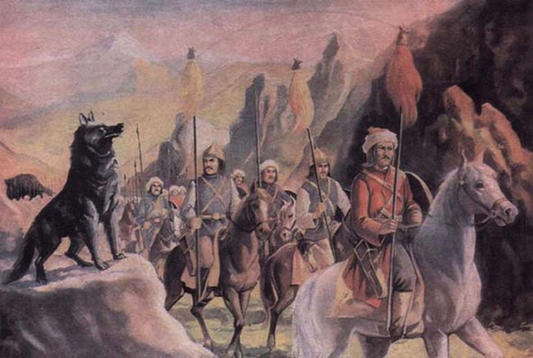
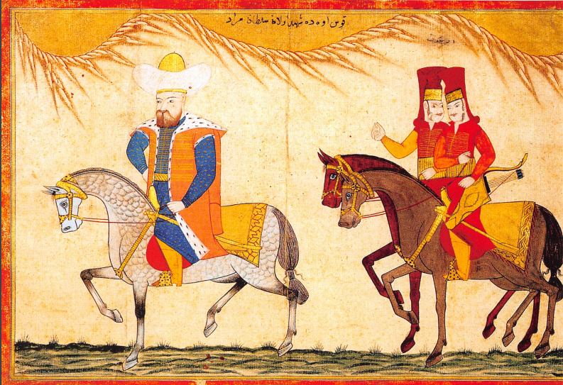
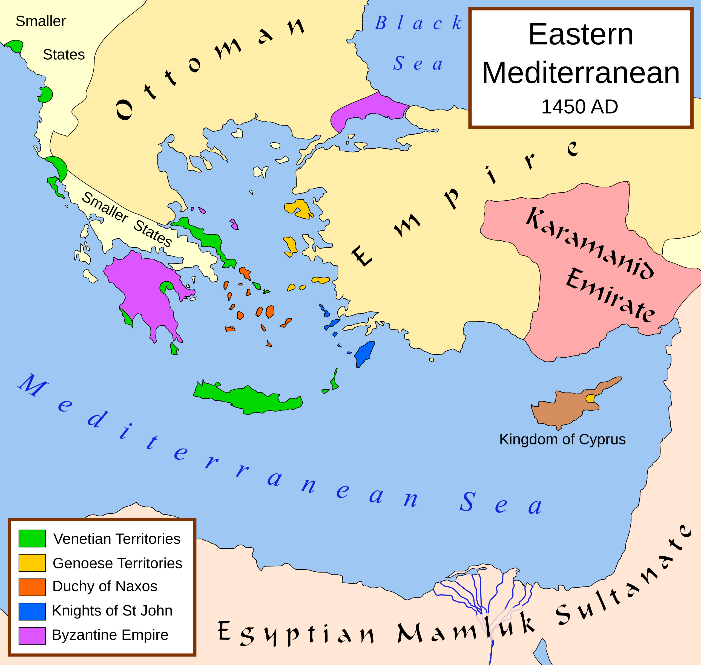
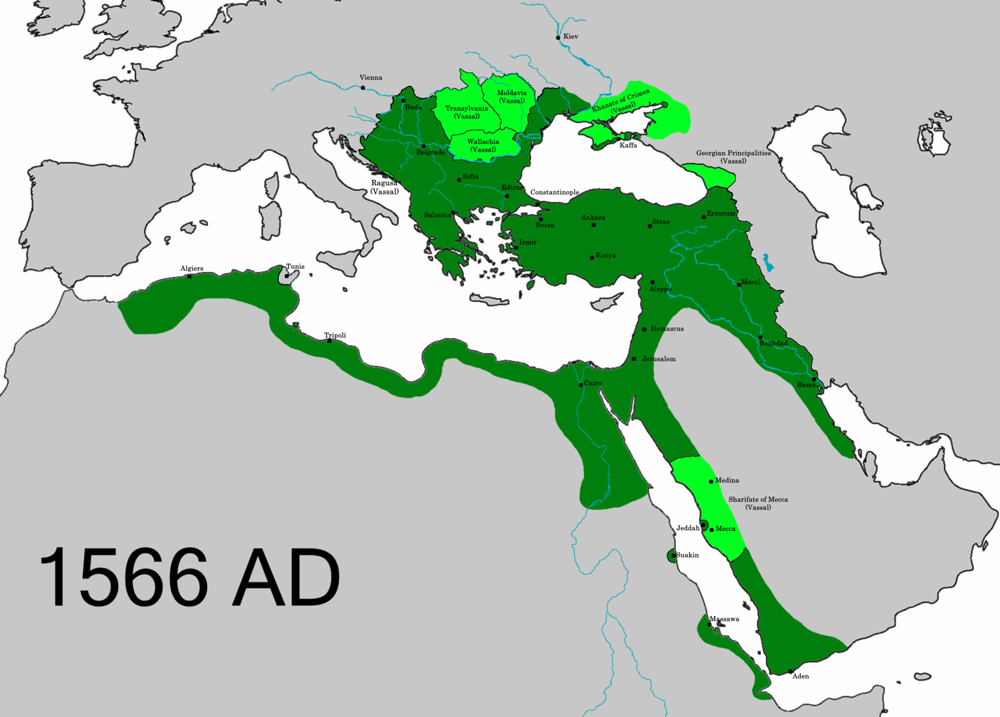

# The Ottoman Empire The Classical Age 1300-1600
by [Halil İnalcık](https://tr.wikipedia.org/wiki/Halil_İnalcık) (1915-2016), 1973

## Pre-book

- Iranian imperial continuity: [Achaemenid Empire](https://en.wikipedia.org/wiki/Achaemenid_Empire) (550–330 BC), [Parthian Empire](https://en.wikipedia.org/wiki/Parthian_Empire) (247 BC-224 AD), [Sasanian Empire](https://en.wikipedia.org/wiki/Sasanian_Empire) (224–651). After the Mongol conquests, the [Ilkhanate](https://en.wikipedia.org/wiki/Ilkhanate) (1256–1335) (İlhanlılar) ruled Persia as a Chinggisid khanate, often in rivalry (and diplomacy) with the [Golden Horde](https://en.wikipedia.org/wiki/Golden_Horde) (Altın Ordu Devleti) to the north.
- The [Amu Darya](https://en.wikipedia.org/wiki/Amu_Darya) (Ceyhun) and [Syr Darya](https://en.wikipedia.org/wiki/Syr_Darya) (Seyhun) rise in the mountains of Afghanistan, Tajikistan, and Kyrgyzstan, flow northwest toward the Aral Sea, and the region between them is known as [Transoxiana](https://en.wikipedia.org/wiki/Transoxiana) ([Maveraünnehir](https://www.nisanyansozluk.com/kelime/Maveraünnehir)).
- Excluding the Shia, Islamic history includes four major caliphates: the [Rashidun Caliphate](https://en.wikipedia.org/wiki/Rashidun_Caliphate) (632–661), the [Umayyad Caliphate](https://en.wikipedia.org/wiki/Umayyad_Caliphate) (661–750), the [Abbasid Caliphate](https://en.wikipedia.org/wiki/Abbasid_Caliphate) (750–1258), and the Ottoman Caliphate (1517–1924).
- In [Josippon](https://en.wikipedia.org/wiki/Josippon), 950, [Togarmah](https://en.wikipedia.org/wiki/Togarmah) is presented as an ancestor of Turkic peoples, with his descendants identified as groups such as the Göktürks, Oghuz, and others.
- [The Huns](https://en.wikipedia.org/wiki/Huns) (or even [Xiongnu](https://en.wikipedia.org/wiki/Xiongnu)) first projected proto-Turkic power across the steppes and triggered the [Great Migration](https://en.wikipedia.org/wiki/Migration_Period). Their identity was shaped by origin myths like [Asena](https://en.wikipedia.org/wiki/Asena) and the [Epic of Ergenekon](https://en.wikipedia.org/wiki/Epic_of_Ergenekon), which centered on a symbolic rebirth in the [Altai](https://en.wikipedia.org/wiki/Altai-Sayan_region). By the 6th century, the [Göktürks](https://en.wikipedia.org/wiki/Göktürks) established the first empire to use "Turk" as an official political name. Later, the [Oghuz tribes](https://en.wikipedia.org/wiki/Oghuz_Turks) rose to prominence and adopted the name [Turkoman](https://en.wikipedia.org/wiki/Turkoman_(ethnonym)) as they moved into the Islamic world by the 10th century.
- [Orkhon Inscriptions](https://en.wikipedia.org/wiki/Orkhon_inscriptions) (8th century): Earliest Turkic writings. Bilingual texts in Middle Chinese and Old Turkic, honoring Göktürk rulers, explaining Turkic rule, values, leadership.
- [Bertrand Russell, 1948](https://downloads.bbc.co.uk/rmhttp/radio4/transcripts/1948_reith3.pdf): I cannot think of anything that mankind has gained by the existence of Jenghis Khan.
- [The Seljuk Empire](https://en.wikipedia.org/wiki/Seljuk_Empire) (1037–1194) emerged as [Tuğrul Bey](https://en.wikipedia.org/wiki/Tughril_I) led Oghuz tribes into the Iranian plateau and challenged both eastern Islamic powers and Byzantine Empire. Adopting Persian administration and the [Nizamiyyah system](https://en.wikipedia.org/wiki/Nezamiyeh), the Seljuks consolidated rule, defeated Byzantium at [Manzikert](https://en.wikipedia.org/wiki/Battle_of_Manzikert) (1071), accelerated the Turkification of Anatolia, peaked under [Malik-Shah I](https://en.wikipedia.org/wiki/Malik-Shah_I), and later fragmented into regional [atabey](https://en.wikipedia.org/wiki/Atabeg) states.

## An Outline of Ottoman History, 1300-1600

### The origins of the Ottoman State
- Initial question is: "How did Osman Gazi's small frontier principality, dedicated to a Holy War against Christian Byzantium, grow to be an empire of such power?". [H.A. Gibbons](https://en.wikipedia.org/wiki/Herbert_Adams_Gibbons) speculates that it is a revival of the Byzantine Empire as a Muslim state. Mehmet Fuat Köprülü disagrees in [The Origins of the Ottoman Empire](https://cityofconstantine.com/books/the_origins_of_the_ottoman_empire).
- There is a parallel between how Rome recruited German soldiers and the [Mamluk](https://en.wikipedia.org/wiki/Mamluk) forces. The Mamluk system originated in the Abbasid Caliphate in the 9th century CE, recruiting enslaved Turkic and Caucasian youths for military service.
- Inalcik marks [Battle of Bapheus](https://en.wikipedia.org/wiki/Battle_of_Bapheus), 1302, as the founding of the principality. Other frontier principalities flocked behind.
- The Ottoman State didn't have the orthodoxy of the hinterland and developed after the raids of the [gazis](https://en.wikipedia.org/wiki/Ghazi_(warrior)). The state aimed to treat all races as one, unite Orthodox Christian Balkans and Muslim Anatolia. Tolerance in exchange for poll-tax, [haraç](https://en.wikipedia.org/wiki/Haraç).
- The case of [Mihal Gazi](https://en.wikipedia.org/wiki/Köse_Mihal), a Greek lord is a famous example of the assimilation.

### From Frontier Principality to Empire
- In 1346, Orhan had made an alliance with a claimant to the Byzantine throne and had married his daughter, [Theodora](https://en.wikipedia.org/wiki/Theodora_Kantakouzene_(wife_of_Orhan)). Later in March 1354, with [Fall of Gallipoli](https://en.wikipedia.org/wiki/Fall_of_Gallipoli), Ottomans established themselves on European soil.

- After the [Ottoman conquest of Adrianople](https://en.wikipedia.org/wiki/Ottoman_conquest_of_Adrianople), 1361, the government encouraged Turks from Anatolia to settle in Europe, [zaviyes](https://en.wikipedia.org/wiki/Zawiya_(institution)) became the nuclei of new Turkish villages and created a firm base in [Thrace](https://en.wikipedia.org/wiki/Thrace). By 1372 Ottomans were the master of the Balkan peninsula, and they again brought nomads from Anatolia, including powerful [yürük](https://en.wikipedia.org/wiki/Yörüks) groups.
- [Janissaries](https://en.wikipedia.org/wiki/Janissary) were the first modern standing army, and perhaps the first infantry force in the world to be equipped with firearms. Inalcik says first standing army in Europe. They are made up through the [devşirme](https://en.wikipedia.org/wiki/Devshirme) system.
- The Ottoman invasion of the Balkans coincided with a time of political fragmentation. The Greek Orthodox populations were fanatically opposed to all Latin influences. This and Janissaries account for the ease of Ottoman conquest in the Balkans.
- Byzantine Empire was losing control of [pronoia](https://en.wikipedia.org/wiki/Pronoia) lands, a Byzantine system granting tax income for service. Ottomans again brought state control and converted them to [timars](https://en.wikipedia.org/wiki/Timar) or distributed to the [yayas](https://en.wikipedia.org/wiki/Yaya_(military)). For the peasantry new regime was an improvement.
- The Ottomans frequently used the policy of legitimization when attacking their Muslim neighbours in the east. See [Battle of Frenkyazısı (1387)](https://en.wikipedia.org/wiki/Battle_of_Frenkyazısı_(1387)). Their aggression was hidden behind gifts and purchasing and if attacked they considered it as an attack to the Holy War. They broadcasted the charges through [fetvas](https://en.wikipedia.org/wiki/Fatwa) to the entire Islamic world. 
- See [Battle of Kosovo](https://en.wikipedia.org/wiki/Battle_of_Kosovo), one of the largest battles of the Late Middle Ages. Inalcik says that it firmly established Ottoman rule in the Balkans. Murad I was killed during this war, only Ottoman Sultan killed on the battlefield.
- Bayezid I won [Battle of Nicopolis](https://en.wikipedia.org/wiki/Battle_of_Nicopolis) (Niğbolu), 1396, against crusades, greatly raising the Ottoman prestige in the Islamic world and became a greater threat to Central Europe. Later in 1402, [Timur](https://en.wikipedia.org/wiki/Timur) defeated Ottomans in the [Battle of Ankara](https://en.wikipedia.org/wiki/Battle_of_Ankara) and took Bayezid prisoner. This led to the 11 years long [Ottoman Interregnum](https://en.wikipedia.org/wiki/Ottoman_Interregnum) (Fetret devri).

### The Interregnum and Recovery
- How did the Ottomans make this recovery so quickly after the rout at Ankara, surrounded by civil war and uprisings? Janissary corps, merchants preferring the Ottomans instead of feudal regimes and the prestige of being the greatest leader of the Holy War.
- The empire was not truly united until 1453, and until then [Mehmed I](https://en.wikipedia.org/wiki/Mehmed_I) (1413-21) and [Murad II](https://en.wikipedia.org/wiki/Murad_II) (1421-44, 46-51) dealt with constant wars. There were also internal power struggles, for example Mehmed I's brother [Küçük Mustafa](https://en.wikipedia.org/wiki/Küçük_Mustafa) was supported by the Byzantine Empire and married into the imperial family.
- Unlike European monarchies, the Ottoman Empire had no hereditary aristocracy outside the ruling dynasty. See [Çandarlı family](https://en.wikipedia.org/wiki/Çandarlı_family), [Köprülü family](https://en.wikipedia.org/wiki/Köprülü_family), [Zaganos](https://en.wikipedia.org/wiki/Zagan_Pasha) and [Şihabeddin](https://en.wikipedia.org/wiki/Hadım_Şehabeddin).
- Murad II's victory in [Battle of Varna](https://en.wikipedia.org/wiki/Battle_of_Varna) (1444) sealed the fate of the Balkans and the Byzantine Empire.

### The Definitive Establishment of the Ottoman Empire
- [Rumelihisarı](https://en.wikipedia.org/wiki/Rumelihisarı) was built by [Mehmed II](https://en.wikipedia.org/wiki/Mehmed_II) (1444-6, 1451-81) in 1452; [Anadoluhisarı](https://en.wikipedia.org/wiki/Anadoluhisarı) was built by Bayezid I in 1394. [Constantinople](https://en.wikipedia.org/wiki/Constantinople) was the historic walled peninsula, today’s old Istanbul district.
- "The siege of Constantinople lasted fifty-four days, from 6 April to 29 May 1453. The defending force numbered some 8,500 men; the regular Ottoman army numbered not less than fifty thousand."
- "Mehmed entered the city in procession, stopped the pillage, and went to the [Hagia Sophia](https://en.wikipedia.org/wiki/Hagia_Sophia) and prayed. He converted the church into a mosque and proclaimed 'Hereafter my capital is Istanbul'". 
- The Ottomans established the Danube as the empire's natural northern frontier. Mehmed's main task in the Balkans was to undermine Hungarian influence.
- [Republic of Venice](https://en.wikipedia.org/wiki/Republic_of_Venice) (697–1797): A Venetian-led [lagoon](https://en.wikipedia.org/wiki/Venetian_Lagoon) polity that replaced earlier Byzantine-era administration and grew into a maritime trading republic, ending when Napoleon dissolved it in 1797.
- [Uzun Hasan](https://en.wikipedia.org/wiki/Uzun_Hasan) (1425–78): Ruler of the Akkoyunlular confederation who built a major power in eastern Anatolia and Iran, fought the Ottomans (notably defeated at [Otlukbeli in 1473](https://en.wikipedia.org/wiki/Battle_of_Otlukbeli)). Timur had appointed Uzun Hasan's grandfather as a governor.

- Inalcik: "Mehmed the Conqueror was the true founder of the Ottoman Empire". See also Character of [Mahomet II](https://www.ccel.org/g/gibbon/decline/volume2/chap68.htm#MahometII) by Edward Gibbon.
- Mehmed appointed [Gennadius](https://en.wikipedia.org/wiki/Gennadius_Scholarius) as Orthodox patriarch, and ordered him to write [The Confession of Faith](https://www.johnsanidopoulos.com/2016/10/the-confession-of-faith-of-gennadios.html). He invited [Gentile Bellini](https://en.wikipedia.org/wiki/Gentile_Bellini) to paint. 
- A Janissary revolt and a general reaction against Mehmed II's administrative and bellicose policies followed his death in 1481. There was a period where Bellini's frescos were broken up. Beyazid II (1481-1512) came to the throne, instead of his brother [Cem](https://en.wikipedia.org/wiki/Cem_Sultan), but effective power temporarily remained in the hands of [Gedik Ahmed](https://en.wikipedia.org/wiki/Gedik_Ahmed_Pasha) and his father-in-law, [Ishak Pasha](https://en.wikipedia.org/wiki/Ishak_Pasha).
- [Kizilbas](https://en.wikipedia.org/wiki/Qizilbash) were mainly Turkoman Shia militant groups in the central Anatolian steppes. They adhered to dervish orders which professed a shamanistic, tribal heterodox version of Islam. In about 1500 [Ismail Safavi](https://en.wikipedia.org/wiki/Ismail_I), first shah of [Safavid Iran](https://en.wikipedia.org/wiki/Safavid_Iran), was their religious leader. They [rebelled in 1511](https://en.wikipedia.org/wiki/Şahkulu_rebellion), led by [sipahis](https://en.wikipedia.org/wiki/Sipahi). So, Selim (1512-20) came to power, killed 40000 kizilbas and won [Battle of Chaldiran](https://en.wikipedia.org/wiki/Battle_of_Chaldiran) in 1514. This caused a mass migration of Turkoman tribes to Iran.
- Mamluks of Egypt were [pressured by Portuguese](https://en.wikipedia.org/wiki/Mamluk–Portuguese_conflicts). Sherif of Mecca asked Selim for help. Selim won [Ottoman–Mamluk War](https://en.wikipedia.org/wiki/Ottoman–Mamluk_War_(1516–1517)) (1516–1517), took Mecca, Damascus and Jerusalem.

### The Ottoman State as a World Power
- "Up to 1596 there was no question of international politics which did not somehow involve the Ottomans".
- Süleyman (1520-66) established [alliance with France](https://en.wikipedia.org/wiki/Franco-Ottoman_alliance). It lasted intermittently until the [Napoleonic campaign in Ottoman Egypt](https://en.wikipedia.org/wiki/French_invasion_of_Egypt_and_Syria), 1798. The alliance was an opportunity for both rulers to fight against the hegemony of the [House of Habsburg](https://en.wikipedia.org/wiki/House_of_Habsburg).
- Süleyman did the [first siege of Vienna](https://en.wikipedia.org/wiki/Siege_of_Vienna_(1529)) in 1529. He captured [Buda in 1541](https://en.wikipedia.org/wiki/Siege_of_Buda_(1541)), leading to about 150 years of Ottoman rule in parts of Hungary. He [besieged Nice](https://en.wikipedia.org/wiki/Siege_of_Nice) in 1543 with French.
- "The French alliance was the cornerstone of Ottoman policy in Europe".

 

- Habsburgs' preoccupation with the Ottomans forced internal religious concessions. By exploiting this, Protestant leaders secured the formal recognition of Lutheranism in Germany by 1555. See [Ottoman Imperialism and German Protestantism, 1521-1555](https://www.abebooks.de/erstausgabe/Ottoman-Imperialism-German-Protestantism-1521-1555-Fischer-Galati/15378658691/bd?srsltid=AfmBOoqCNPjpFi8sPeQsLSpJFakxO36o7QSS3YDotxDgNX4_fAUDuFkd).
- Safavids of Iran distracted Süleyman, and a long series of wars ended with [Peace of Amasya](https://en.wikipedia.org/wiki/Peace_of_Amasya) (1555), which gave him access to the Persian Gulf and established a stable eastern border for the empire.
- These Ottoman enterprises resulted in the effective enlargement of the European system of balance of power.
- [Ivan IV](https://en.wikipedia.org/wiki/Ivan_the_Terrible) (1530-1584): Commonly known as Ivan the Terrible. He is the first Tsar of all Russia. Ivan’s reign transformed Russia from medieval state into empire. He threatened the Ottomans and the khanates of central Asia. The Tsar, the Shah and the Pope tried to unite against Ottomans. Russians were initially passive and peaceful.

### The Decline of the Ottoman Empire
- [Battle of Lepanto](https://en.wikipedia.org/wiki/Battle_of_Lepanto) (1571) (İnebahtı Deniz Muharebesi) was a turning point. Ottomans lost massively. It was the largest naval battle in Western history since classical antiquity, involving more than 450 warships. With the loss of their supremacy in the Mediterranean, they also lost control of their north African provinces. In 1613, Dutch and English pirates were operating on the Red Sea. See [East India Company](https://en.wikipedia.org/wiki/East_India_Company), 1600–1874. Also see for example [Simon Reis](https://en.wikipedia.org/wiki/Zymen_Danseker).
- Beforehand, there was a harmony. In 1510 one gold piece was valued at 54 [akçes](https://en.wikipedia.org/wiki/Akçe), in 1580 at 60. However, disorder came quickly and doomsday was prophesized to fall on 1591, one thousandth anniversary of [hegira](https://en.wikipedia.org/wiki/Hijrah). In the sixteenth century the population increased by 40 per cent in the villages and by 80 per cent in the towns.
- Decline was initially attributed to the fragmentation of the sultan's authority. Introduction of mass firearms and population growth disturbed the timar and devşirme systems. In the 1580s silver coinage was debased, financial crisis aggravated. See [Beylerbeyi event](https://en.wikipedia.org/wiki/Beylerbeyi_event). [The Celali period](https://en.wikipedia.org/wiki/Celali_rebellions) dragged the empire into a decline from which it never recovered.
- The Ottomans, convinced of their own religious and political superiority closed their eyes to the outside world. Their institutions of the classical near-eastern state disintegrated. They failed to understand modern economic problems. Observe the similarity of Chinese reaction to [Macartney Mission](https://en.wikipedia.org/wiki/Macartney_Embassy).

## The State

### The Rise of the Ottoman Dynasty
- [Ahi Brotherhood](https://en.wikipedia.org/wiki/Ahis) played an important part in the establishment of the Ottoman state. See [Şeyh Edebali](https://en.wikipedia.org/wiki/Sheikh_Edebali).
- Ottoman historian [Aşıkpaşazade](https://en.wikipedia.org/wiki/Aşıkpaşazade) records that after Timur's death, the Ottomans produced a genealogy, claiming descent from Oğuz Khan.

### The Manner of Accession to the Throne
- The Ottoman prince who won the support of the Janissaries, ulema, bureaucracy and palace officials, was the legitimate sultan.
- Mehmed II legalized [fratricide](https://en.wikipedia.org/wiki/Fratricide). See also [kafes](https://en.wikipedia.org/wiki/Kafes).
- From the 17th century onward the [şeyhülislams](https://en.wikipedia.org/wiki/Shaykh_al-Islām) often made common cause with the Janissaries, gaining the power to overthrow viziers and sultans. 

### The Ottoman Concept of State and the Class System
- [Kutadgu Bilig](https://en.wikipedia.org/wiki/Kutadgu_Bilig): Written in 1070, it is a [mirror for princes](https://en.wikipedia.org/wiki/Mirrors_for_princes) composed in Old Uyghur script in a language similar to the Orkhon inscriptions. "To control the state requires a large army. To support the troops requires great wealth. To obtain this wealth the people must be prosperous. For the people to be prosperous the laws must be just".
- According to the Göktürk inscriptions, the ideal government follows the töre, and even after converting to Islam, the Mongol Khans of Iran preserved Genghis Khan’s yasa code, consulting it in affairs of state.
- The caliphate theory kept ancient near-eastern ideas but made enforcing [şeriat](https://en.wikipedia.org/wiki/Sharia) the ruler’s duty. [Tursun Bey](https://en.wikipedia.org/wiki/Tursun_Beg): "Government based on reason alone is called sultanic yasak; government based on principles which ensure felicity in this world and the next is called divine policy, şeriat". He equates the state with the absolute authority of the sovereign.
- [Siyasetname](https://en.wikipedia.org/wiki/Siyasatnama), written in the 11th century in Persian, is another mirror for princes. It argues that government can prevent anarchy only if each person remains within his own class. It is written by [Nizam al-Mulk](https://en.wikipedia.org/wiki/Nizam_al-Mulk) who is a Persian vizier of the Seljuk Empire.
- It required exceptional cases for a son of a peasant, [reaya](https://en.wikipedia.org/wiki/Rayah), to enter the military class. Süleyman I even revoked tax exemptions of those who had not entered by descent from military ancestors. Early 17th-century Ottoman writers saw abandoning this principle as the main cause of the empire’s decline.

### Law: Sultanic Law (Kanun) and Religious Law (Şeriat)
- Some Islamic jurists, including [Ibn Khaldun](https://en.wikipedia.org/wiki/Ibn_Khaldun), considered kanun unnecessary. Ottoman kanun originated as [fermans](https://en.wikipedia.org/wiki/Firman). Sometimes decrees were exact translations of the earlier native laws.
- The main purpose of the [sanjak](https://en.wikipedia.org/wiki/Sanjak) kanunnames was to show the rates and manner of collection of the taxes in the timars. The two kanunnames of Mehmed the Conqueror systematized the kanun-i osmani for the first time.
- The penal code was drawn up according to principles such as the [lex talionis](https://en.wikipedia.org/wiki/Eye_for_an_eye). Ottoman law attached great importance to precedent, with [kadis](https://en.wikipedia.org/wiki/Qadi) instructed to record their decision and act according to it in similar situations. Kadis administered both şeriat and kanun.

### The Palace
- Machiavelli in The Prince, chapter 4: "The whole country of the Turk is governed by one master; all the rest are his kuls".
- [Karamani Mehmed Pasha's](https://en.wikipedia.org/wiki/Karamani_Mehmed_Pasha) story can be considered a turning point in early Ottoman elite politics.
- There were levies of devşirme every three to seven years, annually around one to three thousand boys.
- [Kapi ağasi](https://en.wikipedia.org/wiki/Kapi_Agha), the chief white eunuch, was the supervisor of the whole Palace. There were four Chambers in the sultan's service and the has oda's (Privy Chamber) head, called has oda başi, was the closest person to the sultan, never leaving his side.
- [Roxelana](https://en.wikipedia.org/wiki/Roxelana) (1505-1558): Known as Hurrem Sultan, Süleyman I contracted a religious marriage with this Russian slave-girl. In a letter she writes "When - God willing - we are together again, I shall explain..."
- [Ducas](https://en.wikipedia.org/wiki/Demetrius_Ducas) reports that Murad II treated his slaves as brothers. Translation of kul as slaves is misleading. Not just the sultan but all ranks of the military class adopted the slave system.

### The Central Administration
- The government's most important function was the administration of justice. The [imperial council](https://en.wikipedia.org/wiki/Imperial_Council_(Ottoman_Empire)), divan-i hümayun, was essentially a high court but also served as a sort of cabinet.
- Government was composed of three departments: Political, judicial and financial. The holders of the four royal offices were viziers, [kadiaskers](https://en.wikipedia.org/wiki/Kazasker), defterdars and nisanci.
- [Köprülü Mehmed](https://en.wikipedia.org/wiki/Köprülü_Mehmed_Pasha) was grand vizier and founding patriarch of the Köprülü political dynasty. He was given extraordinary powers and political rule without interference.
- None of the valide sultans was as influential as Ahmed I's wife, [Kösem Sultan](https://en.wikipedia.org/wiki/Kösem_Sultan) (1589-1651).
- Murad III's spiritual advisor, şeyh Şücca, was a member of the [halveti order](https://en.wikipedia.org/wiki/Khalwati_order).
- "In Umayyad and Abbasid times only local Christian and Persian scribes had sufficient experience in the techniques of finance and administration and for a long time monopolized the public affairs of the caliphate."
- In 1537, in the central government, there were eighteen secretaries, of whom eleven specialized in political and administrative commands and seven in financial decrees. By 1568 there were 222 secretaries in the Exchequer departments. [Nişanci](https://en.wikipedia.org/wiki/Nişancı) can be considered as the head bureaucrat.
- During decline, secretaries instituted reforms and regarded the adoption of European ideas as the only way of saving the empire, despite the opposition of the ulema. [Katip Çelebi](https://en.wikipedia.org/wiki/Kâtip_Çelebi) (1609-1657), the greatest Ottoman encyclopedic scholar, was a secretary.