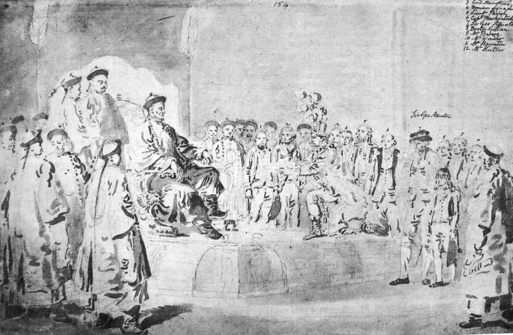
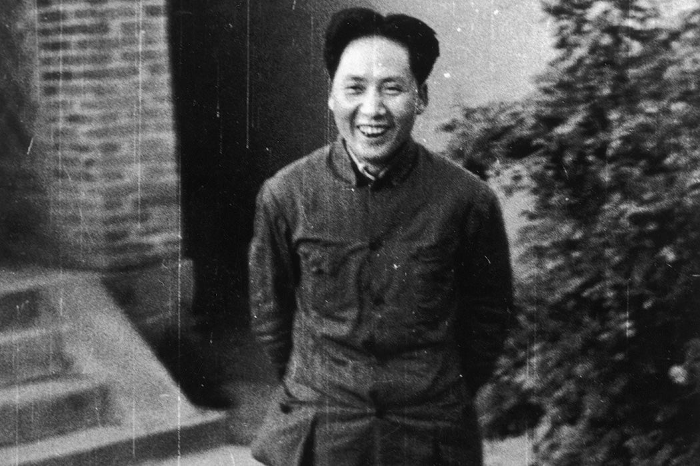
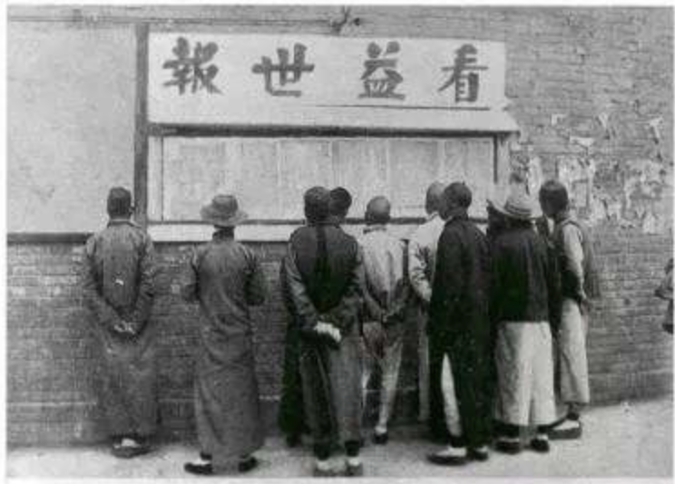

# On China
by Herry Kissinger, 2011

## Prebook

  

- Ancient China – c. 2100–1046 BC – early states, bronze, writing
- Zhou Dynasty – 1046–256 BC – feudal order, Confucius, Daoism emerge
- Warring States – 475–221 BC – rival kingdoms, major philosophies
- Qin Dynasty – 221–206 BC – first unification, legalist empire
- Han Dynasty – 206 BC–220 AD – bureaucracy, Silk Road, expansion
- Three Kingdoms – 220–280 – division, famous warfare era
- Jin & Six Dynasties – 265–589 – fragmentation, cultural innovation
- Sui Dynasty – 581–618 – reunification, Grand Canal
- Tang Dynasty – 618–907 – golden age, cosmopolitan empire
- Song Dynasty – 960–1279 – commerce, gunpowder, printing advances
- Yuan Dynasty – 1271–1368 – Mongol rule, Eurasian connections
- Ming Dynasty – 1368–1644 – maritime voyages, strong state
- Qing Dynasty – 1644–1912 – expansion, later decline
- Republic of China – 1912–1949 – warlords, invasion, civil war
- People’s Republic of China – 1949–present – industrialization, global rise

## The Singulariy of China
- [Yellow Emperor](https://en.wikipedia.org/wiki/Yellow_Emperor): 2700 BC, Yellow River region. Initiator of the Chinese culture, innovator.
- [Romance of the Three Kingdoms](https://en.wikipedia.org/wiki/Romance_of_the_Three_Kingdoms): 14th-century, set in end of Han dynasty. "合久必分，分久必合" - "Hé jiǔ bì fēn, fēn jiǔ bì hé" - "long united, must divide - long divided, must unite".
- [Analects](https://en.wikipedia.org/wiki/Analects): Confucius. Composed during the Warring States period, around 200 pages.
- [Center of Gravity](https://en.wikipedia.org/wiki/Center_of_gravity_(military)): Coined by [Carl von Clausewitz](https://en.wikipedia.org/wiki/Carl_von_Clausewitz), a Prussian military theorist, in [On War](https://en.wikipedia.org/wiki/On_War). More obvious to see in chess than go.
- [The Art of War](https://en.wikipedia.org/wiki/The_Art_of_War): A military treatise attributed to [Sun Tzu](https://en.wikipedia.org/wiki/Sun_Tzu), written during the late [Spring and Autumn period](https://en.wikipedia.org/wiki/Spring_and_Autumn_period). Focuses on strategy, deception, positioning, understanding terrain, morale, and timing. Differs from Western thought by emphasizing the psychological and political elements over the purely military. See [勢 (shì)](https://en.wiktionary.org/wiki/勢#Definitions).
- See [fait accompli](https://en.wiktionary.org/wiki/fait_accompli) and [coup de grâce](https://en.wikipedia.org/wiki/Coup_de_grâce).
- [Hegel - Vorlesungen über die Philosophie der Weltgeschichte](https://philotextes.info/spip/IMG/pdf/hegel_philosophie_der_geschichte.pdf): "China und Indien liegen gleichsam noch außer der Weltgeschichte, als die Voraussetzung der
Momente, deren Zusammenschließung erst ihr lebendiger Fortgang wird." (p. 32, f. 1.41).

## The Kowtow Question and the Opium War

  

- "... challenged the basic [Chinese cosmology](https://en.wikipedia.org/wiki/Chinese_creation_myths) and left wounds still festering over a century later in an age of restored Chinese eminence." See [Macartney Mission](https://en.wikipedia.org/wiki/Macartney_Embassy), 1793. Also see the [official report](https://en.wikipedia.org/wiki/An_Authentic_Account_of_an_Embassy_from_the_King_of_Great_Britain_to_the_Emperor_of_China) (it also has a unique-to-me ToC).
- "The Qing dynasty, in 1715, permitted the establishment of a [Russian Orthodox mission in Beijing](https://en.wikipedia.org/wiki/Russian_Spiritual_Mission_in_Beijing); it eventually took on the role of a de facto embassy, the only foreign mission of its kind in China for over a century."
- Beginning of 19th century, China's GDP was still seven times of Britain's. See [World GDP, 20 Countries and Regional Totals, 0-1998 A.D. (p. 261)](http://piketty.pse.ens.fr/files/Maddisson2001.pdf).

## From the Preeminence to Decline
- "... to modernize along Western lines was to cease to be Chinese, and that nothing could justify abandoning this unique heritage." (p. 59)
- The [Taiping Rebellion](https://en.wikipedia.org/wiki/Taiping_Rebellion), a [Christian](https://en.wikipedia.org/wiki/Millenarianism)-inspired rising of poor laboring villagers with about half a million fighters, and the [Nian Rebellion](https://en.wikipedia.org/wiki/Nian_Rebellion), northern groups of poor mounted fighters totaling about one hundred thousand, rebelled against the Qing around 1850.
- [The Boxer Indemnity Scholarship Program](https://en.wikipedia.org/wiki/Boxer_Indemnity_Scholarship) was a scholarship program for Chinese students to be educated in the United States, funded by the Boxer Indemnities. When the first of these students returned to China, they undertook the teaching of subsequent students; from this institute was born Tsinghua University.
- See [The Protracted Game: A Wei-ch'i Interpretation of Maoist Revolutionary Strategy](https://gwern.net/doc/history/1969-boorman-theprotractedgame.pdf) for an interesting analysis of [Chinese Civil War](https://en.wikipedia.org/wiki/Chinese_Civil_War).
- "Every statesman needs to balance the experience of the past against the claims of the future." (p. 90)

## Mao's Continuous Revolution

  

- [diametrical](https://en.wiktionary.org/wiki/diametrical)
- "[cadres and the masses] ... With new tasks on their shoulders, they are totally preoccupied with the problems for their fulfillment" - Mao, p. 96.
- A state of permanent upheaval and participation in the international system creates a dilemma which Mao couldn't resolve. On one side, the states that prize stability will unite against this constant turmoil. p. 97.
- [Dream of the Red Chamber](https://en.wikipedia.org/wiki/Dream_of_the_Red_Chamber): 18th-century Qing novel featuring aristocratic decline, family life, and emotion. One of China’s [Four Great Classical Novels](https://en.wikipedia.org/wiki/Classic_Chinese_Novels). Mao Zedong claimed to have read the novel five times.
- [The Hundred Flowers Campaign](https://en.wikipedia.org/wiki/Hundred_Flowers_Campaign) (1956–57): Very interesting campaign, referring to Warring States period also. Mao encouraged criticism under "Let a hundred flowers bloom", but when it widened, the campaign flipped into the [Anti-Rightist purge](https://en.wikipedia.org/wiki/Anti-Rightist_Campaign), punishing hundreds of thousands.

## Triangular Diplomacy and the Korean War
- [China White Paper](https://en.wikipedia.org/wiki/China_White_Paper) (1949): a State Department report ordered by Dean Acheson to address criticism over the [Loss of China](https://en.wikipedia.org/wiki/Loss_of_China), explaining U.S. policy toward China as Communist forces neared victory.
- "... acts conceived as defensive in China may be treated as aggressive by the outside world; deterrent moves by the West may be interpreted in China as encirclement."
- "In September and October 1950, when the N[KPA](https://en.wikipedia.org/wiki/Korean_People%27s_Army) were being driven back by the U.S. 8th Army, Stalin – writing under the pseudonym ‘Fyn Si’ – did send two long letters giving military advice to [Kim Il Sung](https://en.wikipedia.org/wiki/Kim_Il_Sung)." [Reference](https://www.johndclare.net/KoreanWar_Stalin.htm)
- There is a telegram from Mao to Stalin (p. 141) (1950 October) of which two contradictory versions are held in the archives of Beijing and Moscow. This suggests that as Chinese troops advanced toward Korea, the Chinese leadership was still debating. As a result of the war, U.S. also showed an inability to harmonize political and military goals.

## China Confronts Both Superpowers
- "In Asia, therefore, there were very few, if any, purely military challenges. Military strategy and political and social reform were inextricably linked."
- ["The Chinese people cannot be cowed by the atom bomb"](https://www.marxists.org/reference/archive/mao/selected-works/volume-5/mswv5_40.htm)
- [On the Cult of Personality and Its Consequences](https://en.wikipedia.org/wiki/On_the_Cult_of_Personality_and_Its_Consequences): Khrushchev's Secret Speech (1956). Sharply criticized Stalin
- [Berlin Crisis of 1961](https://en.wikipedia.org/wiki/Berlin_Crisis_of_1961): Escalation on the ground, led USSR to build Berlin wall.
- [Dalai Lama](https://en.wikipedia.org/wiki/Dalai_Lama): The Dalai Lama, born Tenzin Gyatso in 1935 in Tibet, became the 14th Dalai Lama in 1940. He fled to India in 1959 after [China’s takeover](https://en.wikipedia.org/wiki/Annexation_of_Tibet_by_China) and has lived in exile since, leading Tibetans spiritually.
- "... an almost whimsical pattern of shelling ... Mao described ... as an act of political battle ..."
- [Peaceful coexistence](https://en.wikipedia.org/wiki/Peaceful_coexistence): Soviet Cold War doctrine claiming socialism and capitalism could coexist without war.
- (1958) Soviets proposed the construction of a joint strategic submarine fleet which was strongly [rejected by Mao](https://en.wikipedia.org/wiki/Sino-Soviet_split). Khrushchev secretly visited Beijing in an unsuccessful attempt to salvage the proposal. Three weeks later [Second Taiwan Strait Crisis ](https://en.wikipedia.org/wiki/Second_Taiwan_Strait_Crisis) started. This trick made Eisenhower believe cooperation and forced Khrushchev's hand.
- [Quotations from Chairman Mao Tse-tung](https://en.wikipedia.org/wiki/Quotations_from_Chairman_Mao_Tse-tung): Also known as Little Red Book. Published from 1964 to 1979 and widely distributed during the [Cultural Revolution](https://en.wikipedia.org/wiki/Cultural_Revolution). Also see [Xiaohongshu](https://en.wikipedia.org/wiki/Xiaohongshu).

  [Big-character poster](https://en.wikipedia.org/wiki/Big-character_poster)

  

## A Decade of Crises (1958-1968)
- [Forward Policy](https://en.wikipedia.org/wiki/Forward_policy_(Sino-Indian_conflict)): 1959–1962. India advanced small posts toward disputed frontier, escalating tensions with China. Mao finally canceled the previous withdrawal orders: "Lack of forbearance in small matters upsets great plans. We must pay attention to the situation".
- [Red Guards](https://en.wikipedia.org/wiki/Red_Guards) (1966-1968) carried out assaults during Cultural Revolution. Targeting the [Four Olds](https://en.wikipedia.org/wiki/Four_Olds) and Confucian legacy, students destroyed cultural sites, with [Zhou Enlai](https://en.wikipedia.org/wiki/Zhou_Enlai) intervening to prevent damage to Forbidden City. See also [Criticize Lin, Criticize Confucius](https://en.wikipedia.org/wiki/Criticize_Lin,_Criticize_Confucius).
- "Even in the United States, major legislative acts often comprise thousands of pages that, to put it mildly, only the fewest legislators have read in detail."
- [Food for Peace](https://en.wikipedia.org/wiki/Food_for_Peace) (1954–present): U.S. program sending agricultural aid abroad for diplomacy and hunger relief. See [Public Law 480](https://www.govinfo.gov/content/pkg/STATUTE-68/pdf/STATUTE-68-Pg454-2.pdf).

## The Road to Reconciliation
- [Foreign Affairs](https://www.foreignaffairs.com): American magazine of international relations and U.S. foreign policy, founded in 1922. Eleven U.S. secretaries of state have written essays in Foreign Affairs. See [A Democrat Looks at Foreign Policy, John F. Kennedy, 1957](https://www.foreignaffairs.com/articles/united-states/1957-10-01/democrat-looks-foreign-policy) and [Asia After Viet Nam, Richard M. Nixon, 1967](https://www.foreignaffairs.com/articles/united-states/1967-10-01/asia-after-viet-nam).
- [Edgar Snow](https://en.wikipedia.org/wiki/Edgar_Snow): American journalist, 1905-1972. He was the first Western journalist to interview many of CCP's leaders. He was written off in the American foreign policy establishment as a Beijing propagandist. Due to this, for example, no script of one of his [important interviews](https://www.bannedthought.net/Journalists/Snow-Edgar/EdgarSnow-Life-1971-April30.pdf) reached high levels of government.
- Mao: "... The student strike is a new phenomenon in European history. Students in the capitalist countries usually do not strike. But now, [all under the heaven is great chaos](https://www.wilsoncenter.org/publication/bulletin-no-11-winter-1998)".
- [Li Zhisui](https://en.wikipedia.org/wiki/Li_Zhisui) (1919-1995): Chinese American physician and Mao's personal doctor and confidant. He wrote a biography of Mao entitled [The Private Life of Chairman Mao](https://en.wikipedia.org/wiki/The_Private_Life_of_Chairman_Mao) which is banned in PRC.
- "Nixon intended to free American policy from the oscillations between extremes of commitment and withdrawal and ground it in a concept of the national interest that could be sustained..."
- [The RAND Corporation](https://en.wikipedia.org/wiki/RAND_Corporation) (1948): Global policy think tank. helped inform the United States policy decisions on a wide variety of issues, including the U.S. involvement in the Vietnam War and the U.S.–Soviet nuclear arms confrontation.
- "How to communicate this decision? The Warsaw ambassadorial talks had not been convened for months and would have been too low-level to present a view of such magnitude. The administration therefore decided to go to the other extreme and go public..."
- "Diplomacy to them [the Chinese] is the elaboration of a strategic principle [weaving together political, military, and psychological elements]" and "... once negotiations begin, they [negotiations] are seen [by U.S.] as being propelled by their own internal logic."
- Latin [sic](https://en.wikipedia.org/wiki/Sic) ("thus") signals quoted text is reproduced exactly, including errors or unusual forms.
- [Ping-Pong Diplomacy](https://en.wikipedia.org/wiki/Ping-pong_diplomacy) (1971): U.S.–China relations eased through table tennis exchanges, paving the way for Nixon’s 1972 China visit. See p. 232 on Mao's insomnia.