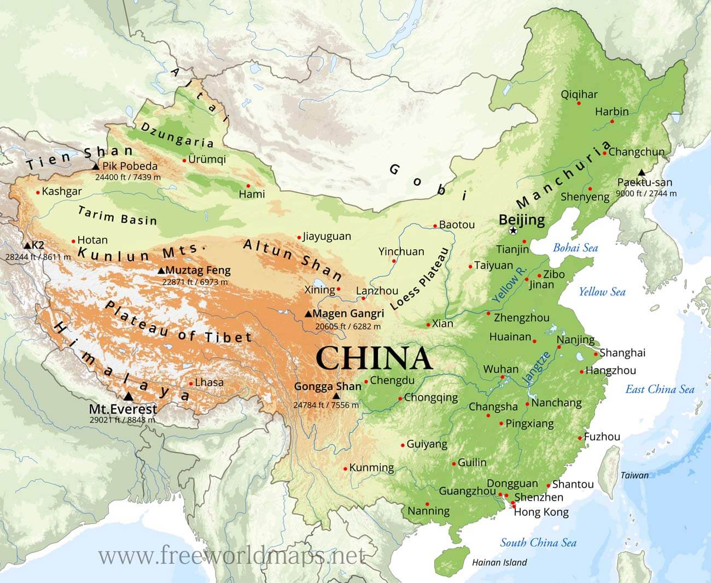

# On China
by Herry Kissinger, 2011

## Prebook

  

- Ancient China – c. 2100–1046 BC – early states, bronze, writing
- Zhou Dynasty – 1046–256 BC – feudal order, Confucius, Daoism emerge
- Warring States – 475–221 BC – rival kingdoms, major philosophies
- Qin Dynasty – 221–206 BC – first unification, legalist empire
- Han Dynasty – 206 BC–220 AD – bureaucracy, Silk Road, expansion
- Three Kingdoms – 220–280 – division, famous warfare era
- Jin & Six Dynasties – 265–589 – fragmentation, cultural innovation
- Sui Dynasty – 581–618 – reunification, Grand Canal
- Tang Dynasty – 618–907 – golden age, cosmopolitan empire
- Song Dynasty – 960–1279 – commerce, gunpowder, printing advances
- Yuan Dynasty – 1271–1368 – Mongol rule, Eurasian connections
- Ming Dynasty – 1368–1644 – maritime voyages, strong state
- Qing Dynasty – 1644–1912 – expansion, later decline
- Republic of China – 1912–1949 – warlords, invasion, civil war
- People’s Republic of China – 1949–present – industrialization, global rise

## The Singulariy of China
- [Yellow Empreror](https://en.wikipedia.org/wiki/Yellow_Emperor): 2700 BC, Yellow River region. Initiator of the Chinese culture, innovator.
- [Romance of the Three Kingdoms](https://en.wikipedia.org/wiki/Romance_of_the_Three_Kingdoms): 14th-century, set in end of Han dynasty. "合久必分，分久必合" - "Hé jiǔ bì fēn, fēn jiǔ bì hé" - "long united, must divide - long divided, must unite".
- [Analects](https://en.wikipedia.org/wiki/Analects): Confucius. Composed during the Warring States period, around 200 pages.
- [Center of Gravity](https://en.wikipedia.org/wiki/Center_of_gravity_(military)): Coined by [Carl von Clausewitz](https://en.wikipedia.org/wiki/Carl_von_Clausewitz), a Prussian military theorist, in [On War](https://en.wikipedia.org/wiki/On_War). More obvious to see in chess than go.